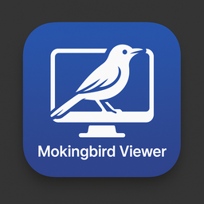
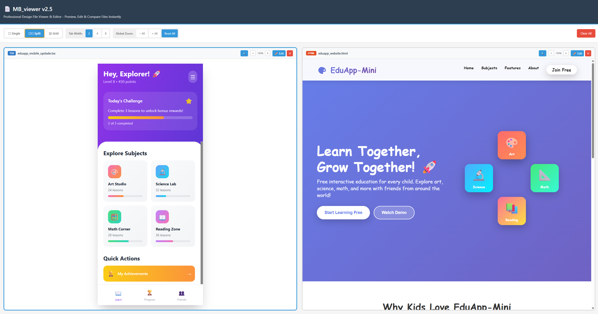
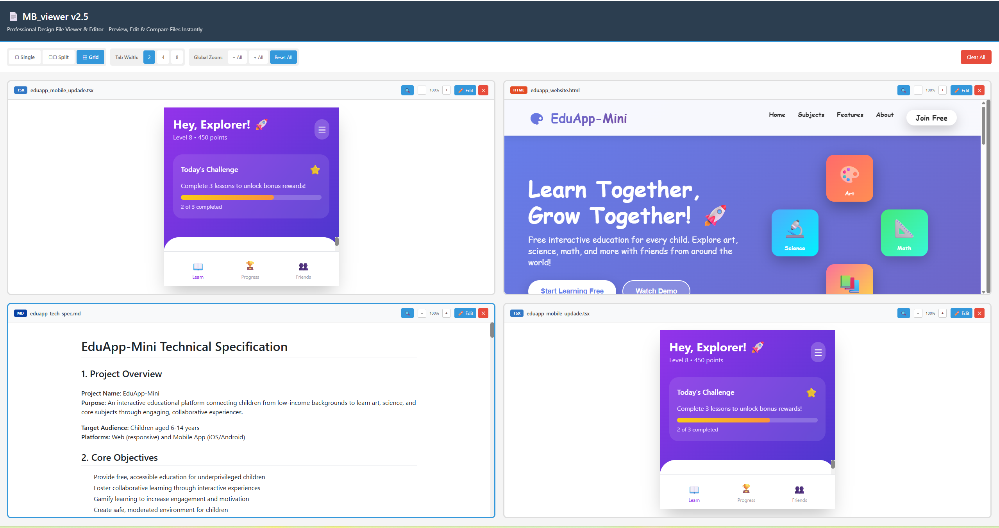
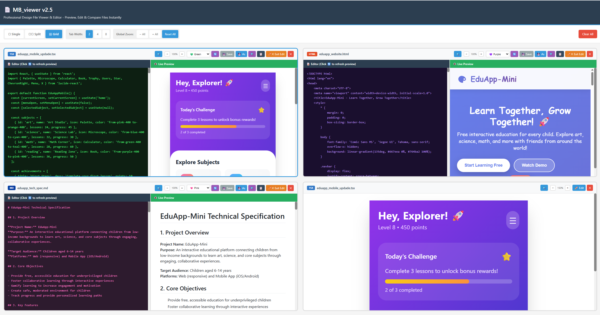

# 🚀 MB_viewer v2.5.0

**The Ultimate Desktop App for Instant TSX/JSX Preview & Editing**

[Features](#-features) • [Download](#-download) • [Quick Start](#-quick-start) • [What's New](#-whats-new-in-v250) • [Documentation](#-documentation)

---

## 📥 Download Latest Version (v2.5.0)

| Platform | Download Link | Size |
|----------|---------------|------|
| 🪟 **Windows** | [MB_Viewer-2.5.0.exe](https://github.com/mokingbird-xyz/mb-viewer-downloads/releases/download/v2.5.0/MB_Viewer.2.5.0.exe) | ~90 MB |
| 🍎 **macOS Intel** | [MB_Viewer-2.5.0-x64.dmg](https://github.com/mokingbird-xyz/mb-viewer-downloads/releases/download/v2.5.0/MB_Viewer-2.5.0.dmg) | ~112 MB |
| 🍎 **macOS Apple Silicon** | [MB_Viewer-2.5.0-arm64.dmg](https://github.com/mokingbird-xyz/mb-viewer-downloads/releases/download/v2.5.0/MB_Viewer-2.5.0-arm64.dmg) | ~113 MB |
| 🐧 **Linux** | [MB_Viewer-2.5.0.AppImage](https://github.com/mokingbird-xyz/mb-viewer-downloads/releases/download/v2.5.0/MB_Viewer-2.5.0.AppImage) | ~120 MB |

[📦 View All Releases](https://github.com/mokingbird-xyz/mb-viewer/releases)

---

## 🎯 What is MB_viewer?

MB_viewer is a **free desktop application** built specifically for **Claude AI users** and developers who need to instantly preview and edit TypeScript React components without any build tools or complex setup.

### 🔥 Perfect for Claude AI Users
Stop copying Claude's `.tsx` outputs to CodePen! MB_viewer lets you drag, drop, and instantly see your components rendered - with **advanced search**, **zoom control**, and **multi-file comparison**.

### ⚡ Zero Setup Required
No npm install. No webpack. No configuration. Just drag, drop, and preview. Available in Win(.exe), Mac and Linux

### 🎨 Production-Ready Features
Advanced search with highlighting, per-panel zoom (50-200%), multi-slot selection, and professional editing tools.

---

## ✨ Features

### 🎯 Key Features (v2.5.0)

- ⚡ **Instant Preview** - Drag & drop files, see results immediately
- 📝 **Live Editor** - Edit code, preview changes in real-time
- 💾 **100% Offline and private** - No internet connection required
- 🔍 **Advanced Search** - Find text with live highlighting in edit & preview modes
- 🔎 **Per-Panel Zoom** - Independent zoom control (50-200%) for each file
- 🎯 **Multi-Select** - Ctrl+click slots to choose which appear in double view
- 🎨 **Multiple Themes** - Light, Dark, GitHub, Monokai editor themes
- 📊 **Multi-File Compare** - View up to 4 files side-by-side

### 📁 Supported File Types

TSX • JSX • HTML • Markdown • JSON • CSS • JavaScript • SVG • TXT

---

## 🚀 Quick Start

1. **Download** the version for your operating system (links above)
2. **Install** - Run the installer (Windows) or drag to Applications (macOS)
3. **Launch** MB_viewer
4. **Drag & drop** any `.tsx`, `.jsx`, `.html`, or `.md` file
5. **Preview instantly** - No npm install, no build tools!

---

## 🎯 Perfect For

- ✅ **Claude AI users** who need instant TSX preview
- ✅ **Developers** doing quick component testing without project setup
- ✅ **Designers** comparing design iterations at different zoom levels
- ✅ **Technical writers** with markdown live preview
- ✅ **Code reviewers** comparing files side-by-side

## Features

### Live Preview

### Split Screen Comparison

### Editing view

## Demo

---

### 🆕 New in v2.5.0 - Advanced Productivity Tools

#### 🔍 Advanced Search System
- **Per-slot search**: Each file has independent search (Ctrl+F)
- **Live highlighting**: See matches in real-time (edit + preview modes)
- **Smart navigation**: Next/Previous buttons with auto-scroll
- **Search button**: 🔍 icon as alternative to keyboard shortcut
- **Result counting**: "2/10" display shows current/total matches
- **File type support**: Works with txt, json, css, js, jsx, tsx, md

#### 🔎 Per-Panel Zoom Control
- **Independent zoom**: Each file has its own zoom level
- **6 zoom levels**: 50%, 75%, 100%, 125%, 150%, 200%
- **Simple controls**: +/− buttons with instant response
- **Persistent**: Zoom preserved across edit/preview toggles
- **Perfect for**: View full layout at 50%, inspect details at 200%

#### 🎯 Multi-Slot Selection
- **Smart selection**: Ctrl+click to choose which files appear in double view
- **Visual feedback**: Active slot (bright blue) vs Selected (light blue)
- **Flexible workflow**: Select files B & D in quad view → switch to double → see only B & D
- **Intelligent fallback**: Auto-selects first 2 non-empty files if needed

#### 🎪 Active Slot Management
- **Keyboard targeting**: Active slot receives Ctrl+F, Ctrl+S shortcuts
- **Clear indicators**: Visual borders show which slot is active
- **Multiple triggers**: Click anywhere on a file panel to make it active

### 📂 Comprehensive File Support
- **React Components** (.tsx, .jsx) - Live preview with instant transpilation
- **Web Pages** (.html) - Sandboxed rendering with JavaScript execution
- **Markdown** (.md) - Beautiful GitHub-style formatting with search
- **Stylesheets** (.css) - Syntax highlighted with search
- **Data Files** (.json) - Validated, formatted, and searchable
- **Scripts** (.js) - Syntax highlighted JavaScript with search
- **Graphics** (.svg) - Direct vector rendering
- **Text** (.txt) - Clean monospace display with search

### ✏️ Professional Live Editor
- **Split-screen editing**: Code on left, live preview on right
- **Real-time updates**: See changes as you type (500ms debounce)
- **4 editor themes**: Light, Dark, GitHub, Monokai (per-file independent)
- **Adjustable tab size**: 2, 4, or 8 spaces
- **Search in editor**: Ctrl+F with highlighting and navigation
- **Context menu**: Right-click for copy all/copy selection
- **Change tracking**: Orange dot shows unsaved modifications

### 💾 Smart Save System
- **Quick save** (Ctrl+S): Save to original file location
- **Save as** (Ctrl+Shift+S): Choose new location
- **Auto-detect changes**: Know exactly when files are modified
- **State preservation**: Edit mode maintained during file refresh

### 🖥️ Flexible View Modes
- **Single View**: Focus on one file with full screen
- **Double View** (Split): Compare 2 files side-by-side
  - **Multi-select**: Ctrl+click to choose which 2 files to display
  - **Smart fallback**: Auto-selects first 2 non-empty files
- **Quad View** (Grid): 2×2 grid for comparing 4 files simultaneously

### 🚀 Maximum Productivity
- **Drag & drop**: Drop files anywhere on any panel
- **Full-panel zones**: Each slot accepts files independently
- **Keyboard shortcuts**: Professional hotkeys for all actions
- **Works offline**: No internet connection required
- **Cross-platform**: Windows, macOS (Intel + Apple Silicon), Linux
- **Zero dependencies**: No configuration or setup needed

---

## 🚀 Quick Start

### Installation

#### Windows
1. Download `MB_Viewer-2.5.0.exe`
2. Double-click to run (portable, no installation needed)
3. Start using immediately!

#### macOS
1. Download the appropriate DMG for your Mac:
   - Intel Macs: `MB_Viewer-2.5.0-x64.dmg`
   - Apple Silicon (M1/M2/M3): `MB_Viewer-2.5.0-arm64.dmg`
2. Open the DMG file
3. Drag MB_viewer to Applications folder
4. Launch from Applications
5. If you see "unidentified developer" warning, right-click → Open

#### Linux
1. Download `MB_Viewer-2.5.0.AppImage`
2. Make it executable: `chmod +x MB_Viewer-2.5.0.AppImage`
3. Run: `./MB_Viewer-2.5.0.AppImage`

### Basic Usage

#### 1. Open a File
- Click "📂 Select File" button
- **OR** drag & drop any supported file onto a panel
- Supports: .tsx, .jsx, .html, .md, .txt, .json, .css, .js, .svg

#### 2. Edit Your File
- Click "✏️ Edit" button to enter edit mode
- Type in the left editor pane
- Watch live preview update on the right
- Changes appear after 500ms of inactivity

#### 3. Search Within Files
- Press `Ctrl+F` (or click 🔍 button)
- Type your search term
- Use ↑↓ arrows to navigate matches
- See highlighted results in real-time

#### 4. Zoom for Details
- Use +/− buttons next to zoom percentage
- Zoom from 50% (full overview) to 200% (pixel-perfect details)
- Each file panel has independent zoom

#### 5. Save Your Changes
- Press `Ctrl+S` to save (or click 💾 Save button)
- Press `Ctrl+Shift+S` for Save As
- Orange dot disappears when saved

#### 6. Compare Multiple Files
- Switch view mode: Single / 2 Split / 4 Grid
- Drag files to different panels
- **Multi-select**: Ctrl+click panels in quad view
- Switch to double view to see only selected panels

---

## ⌨️ Keyboard Shortcuts

| Action | Windows/Linux | macOS | Notes |
|--------|---------------|-------|-------|
| **Open File** | `Ctrl + O` | `Cmd + O` | Open file dialog |
| **Save** | `Ctrl + S` | `Cmd + S` | Save to current file |
| **Save As** | `Ctrl + Shift + S` | `Cmd + Shift + S` | Choose new location |
| **Search** | `Ctrl + F` | `Cmd + F` | Search in active panel |
| **Multi-Select** | `Ctrl + Click` | `Cmd + Click` | Select panels for double view |
| **Reload** | `Ctrl + R` | `Cmd + R` | Reload application |
| **DevTools** | `Ctrl + Shift + I` | `Cmd + Option + I` | Developer tools |
| **Fullscreen** | `F11` | `Ctrl + Cmd + F` | Toggle fullscreen |

---

## 🎨 Visual Indicators

### Panel Border Colors
- **Bright Blue** (#3498db): Active panel - receives keyboard shortcuts (Ctrl+F, Ctrl+S)
- **Light Blue** (#85c1e9): Selected panel - chosen for double view (not currently active)
- **Green** (#27ae60): Drag target - file being dragged over this panel
- **Gray** (#ddd): Default - inactive panel

### File Status
- **Orange Dot**: File has unsaved changes
- **No Dot**: File is saved and unchanged

### Search Highlights
- **Yellow** (#ffeb3b): Search match
- **Orange** (#ff9632): Current active match

---

## 💡 Use Cases

### For Claude AI Users (Primary Audience)
- **Instant TSX preview**: No more copying to CodePen!
- **Search AI-generated code**: Find specific functions or components quickly
- **Compare iterations**: See multiple Claude outputs side-by-side
- **Zoom for details**: Inspect spacing, colors, and layout at 200%

### For React Developers
- **Quick component testing**: View .tsx/.jsx without project setup
- **Isolated debugging**: Test components without dependencies
- **Design comparison**: Compare different implementations with multi-select
- **Code search**: Find hooks, props, or state management patterns

### For Designers
- **No coding required**: Preview React components Claude generates
- **Visual comparison**: Side-by-side design iterations with zoom
- **Pixel-perfect inspection**: 200% zoom for detail work
- **HTML mockups**: Preview static HTML/CSS without a server

### For Technical Writers
- **Markdown editing**: Write docs with live GitHub-style preview
- **Search documentation**: Find sections quickly with Ctrl+F
- **Multi-file docs**: Compare different doc versions
- **Offline writing**: No internet needed

### For Code Reviewers
- **Search & compare**: Find differences between file versions
- **Zoom for details**: Inspect code at comfortable sizes
- **Multi-file review**: Compare original and modified side-by-side
- **Quick preview**: No need to clone repos

---

---

## 🎥 Demo Video

*Coming soon*

---

## 📖 How to Use

### Basic Usage
1. Launch MB_viewer
2. Drag a `.tsx` or `.jsx` file into any panel
3. See instant preview on the right
4. Toggle "Edit" to modify code live

### Advanced Features
- **Search**: Press `Ctrl+F` to search within any panel
- **Zoom**: Use `+`/`-` buttons to zoom 50-200%
- **Multi-Select**: `Ctrl+click` slots to choose which appear in split view
- **Themes**: Click theme dropdown to change editor appearance
- **Compare**: Switch to 2-split or 4-split view to compare files

---

## 🆕 What's New in v2.5.0

### Major Features
- 🔍 Advanced per-slot search system with highlighting
- 🔎 Independent zoom control for each panel
- 🎯 Multi-slot selection with Ctrl+click
- 🎪 Active slot management for keyboard shortcuts
- 🔘 Search icon button as alternative to Ctrl+F

### Bug Fixes
- Fixed search box losing focus
- Fixed search box scrolling issues
- Fixed Ctrl+F targeting wrong slot
- Fixed edit mode highlighting
- Fixed wrong slot editing in double view
- And 3 more critical fixes!

[View Full Changelog](https://github.com/mokingbird-xyz/mb-viewer-downloads/releases)

---

## ❓ FAQ

**Q: Is it really free?**  
A: Yes! Completely free for personal and commercial use.

**Q: Does it work offline?**  
A: Yes! No internet connection needed once installed.

**Q: Do I need Node.js or npm?**  
A: Nope! That's the whole point - zero setup required.

**Q: Can I edit and save files?**  
A: Yes! Edit in the app and use Save/Save As to export changes.

**Q: What about my privacy?**  
A: Everything runs locally on your machine. No data is sent anywhere.

---

## 🆘 Support & Issues

Having problems? 

1. Check the [FAQ section](#-faq) above
2. Search [existing issues](https://github.com/mokingbird-xyz/mb-viewer-downloads/issues)
3. Create a [new issue](https://github.com/mokingbird-xyz/mb-viewer-downloads/issues/new) with details

---

## 📜 License

Free for personal and commercial use. 

---

## 🔗 Links

- 🌐 **Website**: mokingbird.xyz
- 📧 **Contact**: info@mokingbird.xyz
- 📦 **Releases**: [View all versions](https://github.com/mokingbird-xyz/mb-viewer/releases)

---

## ⭐ Show Your Support

If you find MB_viewer helpful, please:
- ⭐ Star this repository
- 🐦 Share on Twitter
- 💬 Tell your designer friends!

---

**Made with ❤️ by [Mokingbird.xyz](https://mokingbird.xyz)**

*Last updated: December 2024 • Version 2.5.0*
